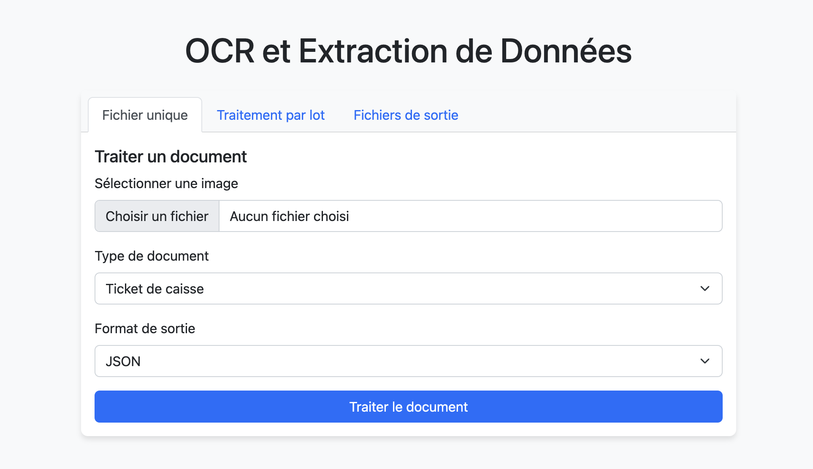

# OCR Document Parser

Application web Flask permettant d'extraire des données structurées à partir de documents numérisés (tickets de caisse, factures, relevés bancaires).

## Fonctionnalités

- Conversion d'images en texte avec prétraitement pour améliorer la qualité
- Extraction de données via expressions régulières
- Support pour différents types de documents (tickets, factures, relevés)
- Traitement unitaire ou par lot
- Export des données en CSV, Excel ou JSON
- Interface web responsive
- API pour intégration avec d'autres services

## Prérequis

- Python 3.8+
- Tesseract OCR 4.0+
- Navigateur web récent

## Installation

1. Cloner le dépôt
```bash
git clone https://github.com/username/ocr-document-parser.git
cd ocr-document-parser
```

2. Créer un environnement virtuel
```bash
python -m venv venv
source venv/bin/activate  # Linux/macOS
venv\Scripts\activate     # Windows
```

3. Installer les dépendances
```bash
pip install -r requirements.txt
```

4. Installer Tesseract OCR
```bash

brew install tesseract

```

5. Créer les dossiers requis
```bash
mkdir uploads output
```

## Utilisation

Lancer l'application :
```bash
python app.py
```

Accéder à l'interface : http://127.0.0.1:5000

### Traitement standard
1. Sélectionner "Fichier unique"
2. Charger une image (jpg, png, tiff)
3. Choisir le type de document
4. Lancer le traitement

### Traitement par lot
1. Sélectionner "Traitement par lot"
2. Charger plusieurs images
3. Définir les paramètres communs
4. Lancer le traitement

### API
Exemple d'utilisation via curl :
```bash
curl -X POST -F "file=@document.jpg" -F "document_type=ticket" http://localhost:5000/api/process
```

## Structure du projet

```
projet/
├── app.py               # Application Flask
├── ocr_engine.py        # Moteur OCR
├── data_extractor.py    # Extraction des données
├── output_manager.py    # Export des résultats
├── templates/           # Interface utilisateur HTML
├── static/              # CSS, JS
├── uploads/             # Images temporaires
├── output/              # Fichiers d'export
└── requirements.txt     # Dépendances
```

## Limitations

- Précision réduite sur documents inclinés
- Optimisé pour formats français standard
- Sensible à la qualité d'image (contraste, netteté)

## Processus de traitement

1. Upload de l'image
2. Prétraitement (amélioration du contraste)
3. OCR via Tesseract
4. Extraction par expressions régulières
5. Présentation et export des résultats


## Améliorations possibles

- Utilisation de deep learning pour l'OCR
- Détection automatique du type de document
- Catégorisation des dépenses
- Intégration comptable
- Support multilingue

## Exemple d'interface



